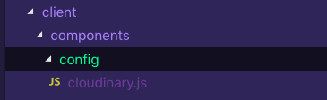
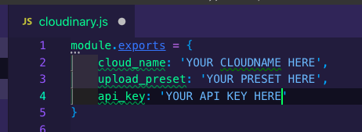

# Scrapbook Studio

## Team Members
* [Christopher Najafi](https://github.com/christophernajafi)
* [Conrad Batraville](https://github.com/theradistcoder)
* [Eric Folks](https://github.com/efolks)
* [Grace Lee](https://github.com/graceleaper)

## Description
Scrapbook Studio is an online studio space where users can create a shared scrapbook with text and images. Users can add new scrapbooks and edit existing ones. Features of the editing space include resizing and rotating media, adding images from a media pool, and creating multiple pages. Friends and family can preserve their memories while showing their creative flairs thanks to this digital scrapbooking experience.

## Deployed Link
[http://scrapbook-studio.herokuapp.com/](http://scrapbook-studio.herokuapp.com/)

## Technologies used
Our team learned new technologies to couple with the stack we used throughout our time at Fullstack Academy. We used PostgreSQL, Sequelize, and Express for the backend along with React/Redux for the frontend. We also implemented Cloudinary to store and process our images and React Konva for our canvas. 

## Get Started
```
git clone https://github.com/1902cs-manatee-hotel/ScrapBookStudio2.git
npm install
npm run seed
npm start
Go to localhost:8080
To upload to Cloudinary, register a Cloudinary account and get an API key
```

## Cloudinary Setup
- Register Cloudinary account
- Obtain API key
- Create config directory in client/components
- - 
- Create cloudinary.js file containing API key
- - 